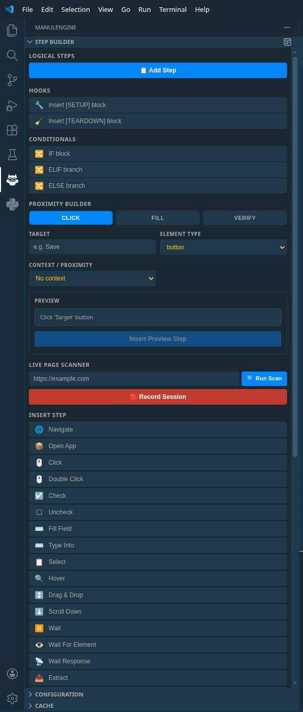
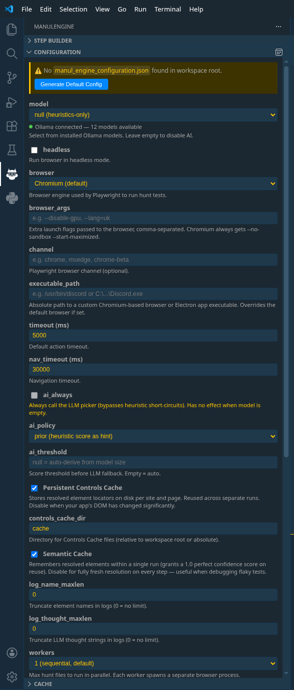

<p align="center">
    
</p>

# ManulEngine — VS Code Extension

[](https://marketplace.visualstudio.com/items?itemName=manul-engine.manul-engine)
[](https://pypi.org/project/manul-engine/)
[](https://pepy.tech/projects/manul-engine)
[](https://marketplace.visualstudio.com/items?itemName=manul-engine.manul-mcp-server)
[](#status)

Write browser automation in plain English. Run it, debug it, and understand every decision the engine makes — all without leaving VS Code.

> **Alpha.** Solo-developed and actively battle-tested. Feature-rich, not yet hardened across every edge case. The goal is transparent execution and strong debugging ergonomics, not inflated claims.

---

## What you get

- **Run and debug `.hunt` files** — one-click execution, gutter breakpoints, floating QuickPick debug overlay, and live Test Explorer timeline
- **Deterministic explainability** — hover any step mid-debug to see the full per-channel scoring breakdown (Text, Attributes, Semantics, Proximity, Cache) that explains *why* a target was chosen
- **Step Builder** — insert any DSL command with a single click; compose contextual qualifiers (`NEAR`, `ON HEADER`, `INSIDE row`) with a live preview, no DSL syntax to memorize
- **Test Explorer integration** — run individual hunts or entire directories, see nested step items with pass/fail/skipped status streaming in real time
- **MCP Server** — pair with the companion MCP extension to let GitHub Copilot drive a real browser session via `manul_run_step`, `manul_scan_page`, and `manul_save_hunt`

---

## Quickstart

### 1. Install the runtime

```bash
pip install manul-engine==0.0.9.28
playwright install chromium
```

### 2. Install the extension

```bash
code --install-extension manul-engine.manul-engine
```

### 3. Create a hunt file

Open your project in VS Code. Create `tests/hello.hunt`:

```text
@context: Verify the example page loads
@title: hello

STEP 1: Open the page
    NAVIGATE to https://example.com
    VERIFY that 'Example Domain' is present

DONE.
```

### 4. Run it

Click `▶` in the editor title bar — or right-click the file → *ManulEngine: Run Hunt File*. Output streams into the **ManulEngine** panel. Done.

**From the terminal:**

```bash
manul tests/hello.hunt
manul tests/                       # run every .hunt in the directory
manul --headless --html-report tests/
```

---

## Hands-on walkthroughs

### Run a hunt

```text
@context: Login flow smoke test
@title: smoke_login
@tags: smoke, auth

@var: {email}    = user@example.com
@var: {password} = secret

STEP 1: Login
    NAVIGATE to https://app.example.com/login
    FILL 'Email' field with '{email}'
    FILL 'Password' field with '{password}'
    CLICK the 'Sign In' button
    VERIFY that 'Dashboard' is present

DONE.
```

| Method | How |
|--------|-----|
| **Editor title button** | Click `▶` in the top-right when a `.hunt` file is open |
| **Explorer context menu** | Right-click a `.hunt` file → *ManulEngine: Run Hunt File* |
| **Terminal mode** | Right-click → *ManulEngine: Run Hunt File in Terminal* (raw integrated terminal) |

Output streams live into a dedicated **ManulEngine** output channel. The extension delegates to the real `manul` CLI — browser hunts, desktop/Electron hunts (`OPEN APP` + `executable_path`), and Python hooks all work identically.

### Debug a hunt

1. **Set breakpoints** — click the editor gutter next to any step line.
2. **Launch Debug** — use the *Debug* profile in Test Explorer, or *ManulEngine: Debug Hunt File* from the Command Palette.
3. **The floating QuickPick overlay appears** — no modal dialogs, no stolen focus:

   | Action | What it does |
   |--------|--------------|
   | **Next Step** | Advance exactly one step and pause again |
   | **Continue All** | Run until the next gutter breakpoint or end of hunt |
   | **Explain Next Step** | Show the live heuristic explanation for the paused step inline |
   | **Stop** | Dismiss the overlay and terminate the run cleanly |

4. **Persistent magenta highlight** — the resolved target element is outlined with a `4px solid #ff00ff` border + glow in the browser while paused. Removed automatically before the action executes.
5. **Edit-and-re-explain** — change the paused step line in the editor, then trigger **Explain Next Step** again. The extension sends the current editor text instead of stale cached text.

**Outcome:** You see exactly where execution paused, control how it advances, and interrogate the engine's reasoning at every step.

### Explainability

During a debug session, **hover any step line** in the editor. A rich Markdown tooltip shows the full scoring breakdown:

```
Target: 'Sign In' button
Score:   0.87 (high confidence)
─────────────────────────────
Text:       0.95  (exact match on innerText)
Attributes: 0.80  (aria-label partial)
Semantics:  0.85  (button role + submit type)
Proximity:  0.90  (NEAR 'Password' qualifier)
Cache:      —     (no prior cache hit)
```

A separate **ManulEngine: Explain Heuristics** output channel captures the full scoring detail for every step.

**Outcome:** You never guess why the engine picked a specific element. Every score is normalized 0.0–1.0, per-channel, per-element.

### Step Builder and Proximity Builder



The **Step Builder** sidebar inserts DSL commands with a single click — every command from the DSL registry is available as a button.

The **Proximity Builder** form lets you compose contextual steps visually:

1. Choose a step kind: **Click**, **Fill**, or **Verify**
2. Set the target, element type, and optional value
3. Pick a context qualifier: `NEAR`, `ON HEADER`, `ON FOOTER`, or `INSIDE row`
4. Preview the generated DSL line, then click **Insert**

```text
Click 'Delete' button INSIDE 'Actions' row with 'John Doe'
```

**Outcome:** Zero DSL memorization. The preview shows exactly what will be inserted.

### Cache Browser

The **Cache** sidebar tree shows per-site entries from ManulEngine's persistent controls cache:

- Browse sites and their cached page entries
- Clear cache for a specific site (trash icon on hover)
- Clear all entries at once (toolbar button)

**Outcome:** Inspect and manage the locator cache without touching disk files.

### Custom controls

Some UI widgets defy heuristic targeting — React virtual tables, canvas datepickers, WebGL overlays. **Custom Controls** let SDETs write Playwright Python while the hunt file stays plain English.

```python
# controls/booking.py
from manul_engine import custom_control

@custom_control(page="Checkout Page", target="React Datepicker")
async def handle_datepicker(page, action_type, value):
    await page.locator(".react-datepicker__input-container input").fill(value or "")
```

The hunt file stays unchanged:

```text
FILL 'React Datepicker' with '2026-12-25'
```

Debug breakpoints, Test Explorer, and live output streaming work identically whether a step hits a custom control or the standard heuristic pipeline.

> **Team workflow:** QA authors keep writing plain English. SDETs own the `controls/` directory. The hunt file never changes when the Playwright logic evolves.

---

## Key features

### Dual-persona workflow

- **QA / Business Analysts / Ops** — write automation in plain English, no selectors, no code
- **Developers / SDETs** — write Python control hooks for complex widgets; the rest of the team keeps writing English

### Language support

- Syntax highlighting, comment toggling (`#`), bracket/quote matching, file icon
- `CompletionItemProvider` with three layers: metadata directives (`@context:`, `@var:`, `@tags:`, `@data:`, `@schedule:`), hook blocks (`[SETUP]`/`[TEARDOWN]`), and full DSL snippets with tab-stop placeholders

### Test Explorer

- Hunt files appear as top-level items (one per file); each step/block is a nested child
- **Run** and **Debug** profiles
- Child items stream from the engine's live hierarchical stdout — the timeline reflects real runtime state, not a reconstructed summary
- Failed steps include the engine output as the failure message; unreached steps are marked skipped

### Debug UX

- **Floating QuickPick overlay** — Next Step, Continue All, Explain Next, Stop
- **Persistent magenta highlight** on the resolved browser element while paused
- **Edit-and-re-explain** workflow: modify the paused step, re-trigger Explain
- Linux: VS Code window is raised via `xdotool`/`wmctrl`; 5-second `notify-send` on pause
- `--break-lines` piped stdio protocol: Python emits a marker on stdout; the extension responds on stdin

### Configuration panel



Interactive sidebar for `manul_engine_configuration.json` — model selection, browser choice, timeouts, cache toggles, workers, screenshot mode, explain mode. Ollama status indicator with live reachability and model autocomplete.

### Executable auto-detection

The extension probes in order: custom `manulPath` setting → workspace `.venv/bin/manul` (also `venv/`, `env/`, `.env/`) → `~/.local/bin/manul` → pipx path → Homebrew → system path → shell login init lookup. Windows paths are covered too.

### Conditional branching

```text
IF button 'Save' exists:
        CLICK the 'Save' button
ELIF text 'Error' is present:
        VERIFY that 'Error' is present
ELSE:
        VERIFY that 'Fallback' is present
```

`IF`/`ELIF`/`ELSE` blocks are first-class: syntax highlighting, validation, Step Builder buttons, and autocomplete all support them.

---

## Settings reference

| Setting | Default | Description |
|---------|---------|-------------|
| `manulEngine.manulPath` | `""` | Absolute path to `manul` CLI. Empty = auto-detect. |
| `manulEngine.configFile` | `manul_engine_configuration.json` | Config file name at workspace root. |
| `manulEngine.workers` | `null` | Max concurrent hunts in Test Explorer (1–4). |
| `manulEngine.htmlReport` | `false` | Generate HTML report after each run. |
| `manulEngine.retries` | `0` | Retry failed hunts N times (0–10). |
| `manulEngine.screenshotMode` | `"on-fail"` | `none`, `on-fail`, or `always`. |
| `manulEngine.testsHome` | `"tests"` | Directory for new hunt files. |
| `manulEngine.autoAnnotate` | `false` | Insert `# 📍 Auto-Nav:` comments on URL changes. |
| `manulEngine.explainMode` | `false` | Always enable detailed heuristic explain output. |
| `manulEngine.verifyMaxRetries` | `null` | Override polling retry count for `VERIFY` steps. |
| `manulEngine.debugPauseTimeoutSeconds` | `300` | Auto-resume after N seconds. `0` = no timeout. |
| `manulEngine.browser` | `"chromium"` | `chromium`, `firefox`, `webkit`, `chrome`, `msedge`, or `electron`. |

---

## System requirements

| | Minimum | Recommended |
|---|---------|-------------|
| **Python** | 3.11+ | 3.12+ |
| **RAM** | 4 GB | 8 GB |
| **GPU** | none | none |
| **Model** | — (heuristics-only) | `qwen2.5:0.5b` (optional) |

---

## Ecosystem

### ManulEngine runtime

The deterministic Playwright-backed runtime that interprets `.hunt` files. Resolves DOM elements with weighted heuristic scoring (`DOMScorer` + `TreeWalker`), no CSS selectors, no cloud APIs.

```bash
pip install manul-engine==0.0.9.28
```

[PyPI](https://pypi.org/project/manul-engine/) · [GitHub](https://github.com/alexbeatnik/ManulEngine)

### MCP Server for GitHub Copilot

Turns ManulEngine into a native MCP server. Copilot Chat gains tools like `manul_run_step`, `manul_run_goal`, `manul_scan_page`, and `manul_save_hunt` — driving a real browser session from natural language.

```bash
code --install-extension manul-engine.manul-mcp-server
```

[Marketplace](https://marketplace.visualstudio.com/items?itemName=manul-engine.manul-mcp-server) · [GitHub](https://github.com/alexbeatnik/ManulMcpServer)

### Python API (`ManulSession`)

Async context manager for pure-Python automation, routed through the full heuristic pipeline.

```python
from manul_engine import ManulSession

async with ManulSession(headless=True) as session:
    await session.navigate("https://example.com/login")
    await session.fill("Username field", "admin")
    await session.click("Log in button")
    await session.verify("Welcome")
```

---

## Contribute

```bash
git clone https://github.com/alexbeatnik/ManulEngineExtension
cd ManulEngineExtension
npm install
npm run compile
npx vitest run           # all tests must pass
```

1. Fork and create a feature branch
2. Make changes, run `npx vitest run` and `npx eslint .`
3. Open a PR against `main`

Custom controls go in `controls/` at the workspace root. The DSL command registry lives in `src/shared/index.ts` — adding a command there auto-exposes it in autocomplete, Step Builder, and the validation pipeline.

---

## Get involved

Try the extension. [File an issue](https://github.com/alexbeatnik/ManulEngineExtension/issues) if something breaks. [Open a discussion](https://github.com/alexbeatnik/ManulEngineExtension/discussions) for ideas and feedback. PRs welcome.

---

## What's New in 0.0.9.28

- Bumped extension manifest to `0.0.928` and pinned ManulEngine runtime to `0.0.9.28`.
- Added `IF`/`ELIF`/`ELSE` conditional branching — syntax highlighting, validator, Step Builder buttons, autocomplete.
- Updated all DSL contracts from engine (labels to ALL\_UPPERCASE canonical form, new `casePolicy` and `elementTypeHint` metadata).
- Added new `MANUL_DEBUG_CONTRACT.md` from engine.
- Removed "Add Demo Tests" and "Add Default Prompts" buttons and related scaffolding.

<details>
<summary>0.0.9.27</summary>

- Replaced `Math.random()` nonces with `crypto.randomBytes` in all webview panels.
- Moved explain-next results into the floating debug QuickPick; removed the modal score panel flow.
- Centralized hunt process spawn argument/env construction; removed duplicate `--explain` injection.
- TTL-based eviction for cached login-shell `manul` lookups.
- Oversized stdout/JSON guards, pause-timeout cleanup, safer stdin writes during backpressure.
- Normalized config writes through a strict allowlist.
- Added `LIVE_SCAN_TIMEOUT_MS` kill timeout to explain runs.
- Fixed inline `require("child_process")` in `explainLensProvider` to top-level import.

</details>

<details>
<summary>0.0.9.26</summary>

- Moved the VS Code extension from `packages/extension` to the repository root.
- Kept runtime contracts and shared logic under `src/shared`.
- Preserved the pinned ManulEngine runtime at `0.0.9.26` and manifest version at `0.0.926`.

</details>

## License

**Version:** 0.0.928

Apache-2.0. See `LICENSE`.